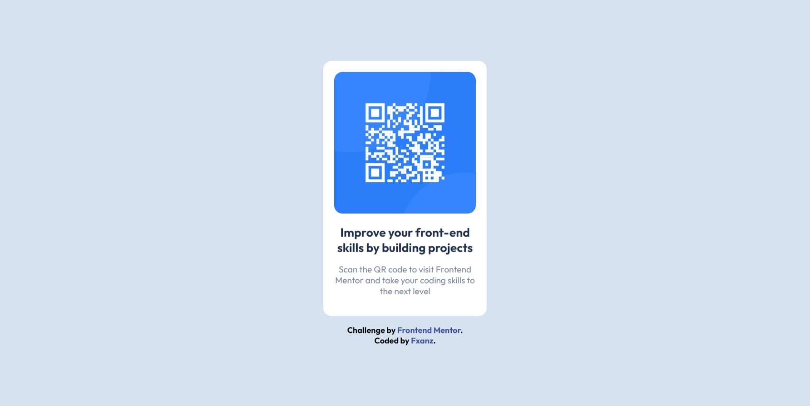

# Frontend Mentor - QR code component solution

This is a solution to the [QR code component challenge on Frontend Mentor](https://www.frontendmentor.io/challenges/qr-code-component-iux_sIO_H). Frontend Mentor challenges help you improve your coding skills by building realistic projects.

## Table of contents

- [Overview](#overview)
  - [Screenshot](#screenshot)
  - [Links](#links)
- [My process](#my-process)
  - [Built with](#built-with)
  - [What I learned](#what-i-learned)
  - [Continued development](#continued-development)
- [Author](#author)

## Overview

### Screenshot



### Links

- Solution URL: [My Solution](https://www.frontendmentor.io/solutions/qr-code-component-using-css-grid-SR_ZsmSKVQ)
- Live Site URL: [Live Site](https://fxanz.github.io/Frontendmentor-QR-Code-Component/)

## My process

### Built with

- Semantic HTML5 markup
- CSS custom properties
- Flexbox

### What I learned

have more understanding of how multiple div work in HTML

```html
<div class="wrapper">
  <div class="img-box">
    
  </div>
  <div class="text">
    <p class="header">Improve your front-end skills by building projects</p>
    <p class="subheader">Scan the QR code to visit Frontend Mentor and take your coding skills to the next level</p>
  </div>
</div>
```

have more understanding of how to middle HTML element using flexbox

```css
body {
  display: flex;
  justify-content: center;
  align-items: center;
  height: 100vh;
  background-color: hsl(212, 45%, 89%);
  text-align: center;
  font-family: "outfit", sans-serif;
}
```

have more understanding how grid work

```css
.article-qr {
  display: grid;
  grid-template-columns: 300px;
}
```

### Continued development

I want to learn more about flexbox because I still have some confusion in some situations and to find out when is the best time to use flexbox and grid or just one

## Author

- Frontend Mentor - [@fxanz](https://www.frontendmentor.io/profile/fxanz)
- Twitter - [@IFxanz](https://twitter.com/IFxanz)
